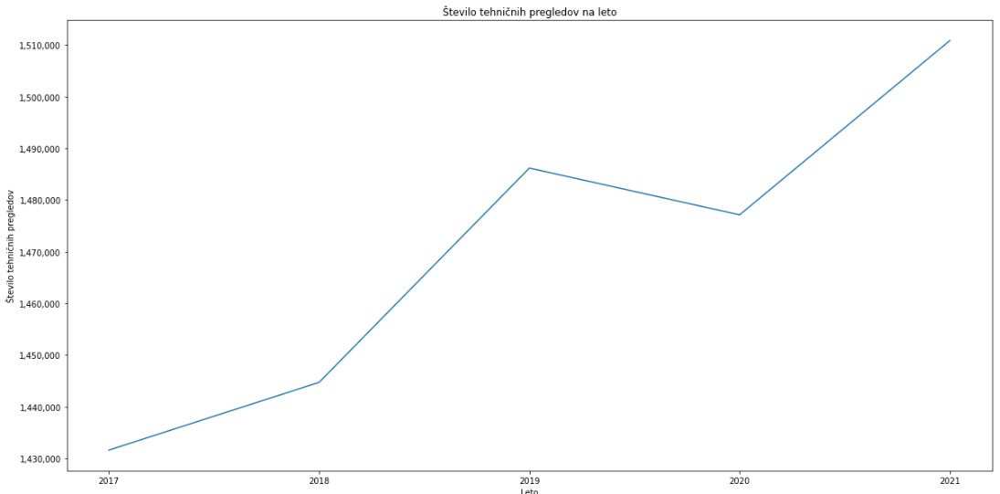
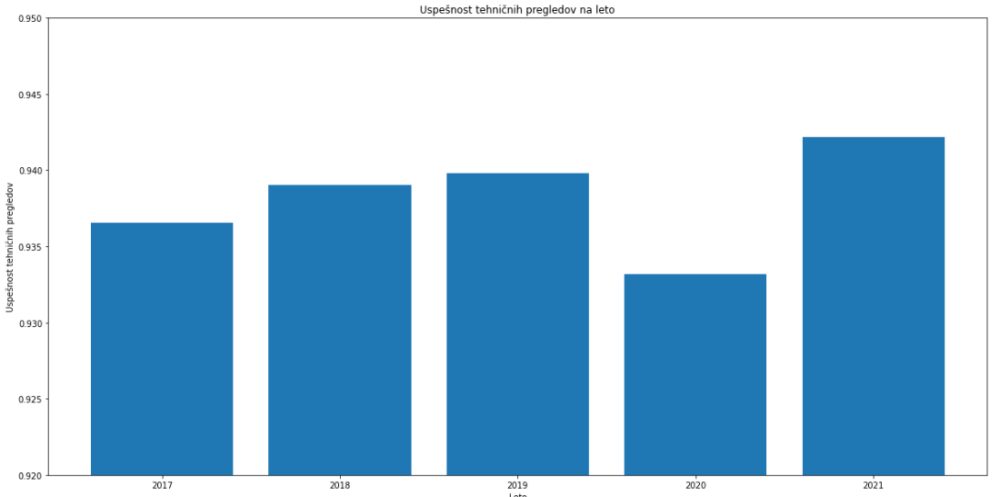
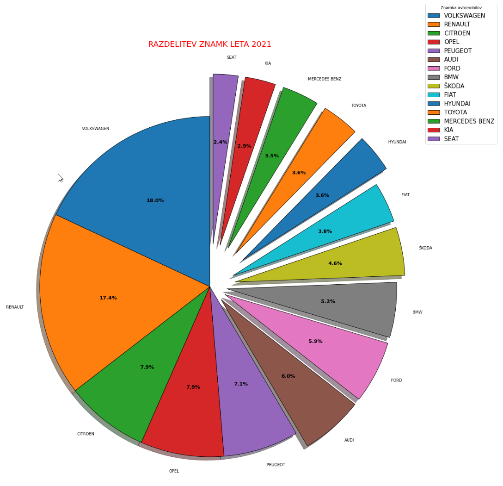
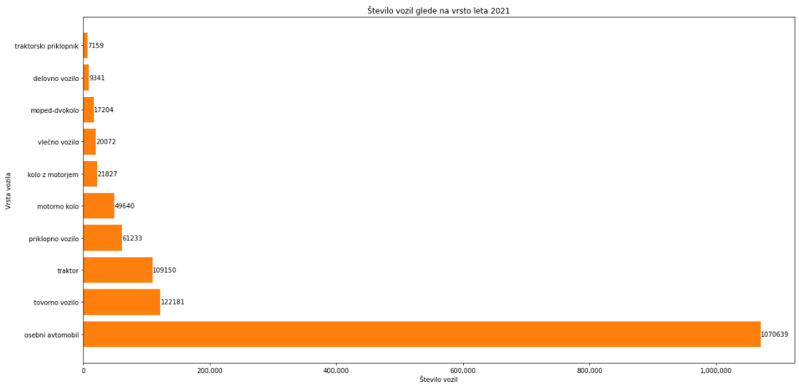
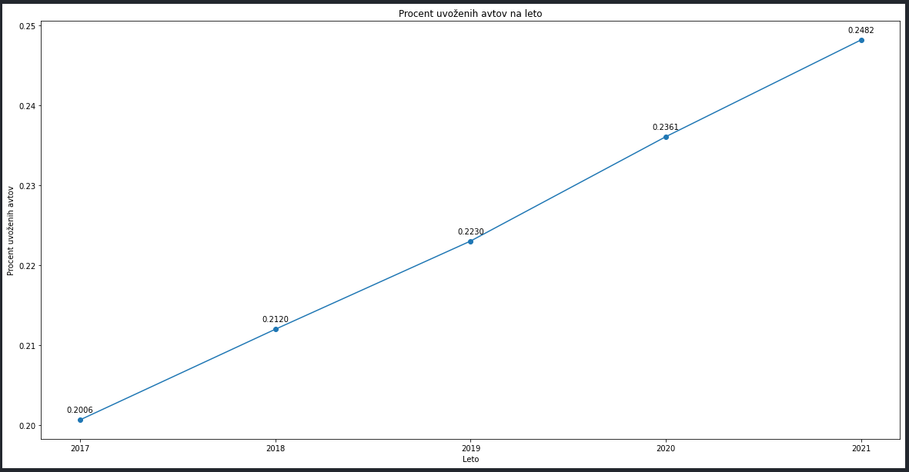

# Podatkovno rudarjenje - Seminarska naloga

## Skupina:

- Anže Šavli
- Anže Javornik
- Timotej Rozina
- Jan Mrak

## Opis naloge:

### Tema 

Tehnični pregledi

### Cilji

V tej seminarski nalogi bomo obdelali in ugotavljali vzorce, povezave in verjetnosti, da dolečena skupina avtomobilov opravi tehnični pregled. Osredotočili se bomo na grupiranje podatkov na čim več in čim bolj raznolikih in zanimivih skupin, v kateri se bodo podatki med seboj logično povezovali. 

Nekaj ciljih skupin smo si že zastavili in sicer bomo primerjali uspešnost na tehničnih pregledih glede na znamko avtov, glede na število prevoženih kilometrov, glede na leto prve registracije, itd.

### Podatki

Glavni vir podatkov bo spletna stran ministrstva za javno upravo (vir: https://podatki.gov.si/) in sicer se bomo osredotočili na rubriko "Promet in infrastruktura", kjer je veliko uporabnih skupin podatkov, med katerimi se bomo osredotočili na skupino, ki opisuje rezultate tehničnih pregledov motornih vozil, saj vsebuje veliko podrobnosti o različnih avtomobilih in postopkih tehničnega pregleda (npr.: znamka avta, model avta, fizična/pravna oseba, število prevoženih km, leto prve registracije, podrobnosti v homologaciji, ipd.). Podatke bomo na koncu probali predstaviti na zanimiv in poučen način s pomočjo pestrih grafov.

## Vmesno poročilo seminarske naloge

### Cilji naloge

Zadali smo si naslednje cilje:
1. Z analizo rezultatov tehničnih pregledov motornih vozil bomo ugotovili, katera od lastnosti vozila (znamka, starost, prevoženi kilometri itd.) najbolj vpliva na verjetnost, da vozilo uspešno opravi tehnični pregled.
2. Lastnosti, ki najbolj vplivajo na uspešnost tehničnih pregledov bomo bolj podrobno analizirali, npr. katera znamka je na tehničnih pregledih najmanj zanesljiva, ali imajo novejši avtomobili več možnosti, da uspešno opravijo tehnični pregled itd.
3. Ugotovili bomo, ali se število tehničnih pregledov z leti zvišuje in kako se ob tem spreminja odstotek uspešnosti pregledov.
4. Ugotovili bomo, kako se po letih spreminja število uvoženih avtomobilov in če imajo višjo verjetnost, da opravijo tehnični pregled.
### Začetki naloge

Z analizo podatkov smo začeli z branjem vseh podatkov v python. Odličili smo se, da bomo uporabili podatke zadnih 5-ih let. Že tu smo naleteli na težave, ker podatki čez leta niso bili poenoteni npr. med leti so bile različne datoteke (.csv, .txt), zaradi količine podatkov, so kasnejših letih bili podatki razpršeni v več datotek, medtem ko so bili podatki v bolj zgodnih letih v enih datotekah, zato smo bili primorani podatke standardizirati. Tu pa smo tudi naleteli na težave, saj so bile nekatere združene datoteke prevelike, da bi jih python uspešno prebral. Ko smo to rešili, pa smo ugotovili, da nekatere datoteke uporabljajo ANSI kodiranje, nekatere pa UTF-8, to smo popravili tako, da smo pri branju datotek za vsako branje določili pravilno kodiranje.  
Po vseh težavah smo končno lahko prebrali datoteke in jih shranili v imenik, ki je za ključe uporabljal leto iz katerega so bili podatki prebrani. Vrednost imenikov je tabela treh pandas tabel. V prvi pandas tabeli so podakti o neuspelih tehničnih pregledih, v drugi tabeli so podatki o vseh tehničnih pregledih tistega leta, v tretji tabeli pa so shranjene vsi podatki o meritvah.

### Analiza podatkov

Za začetno točko smo naredili graf števila tehničnih pregledov po letih.

Ugotovili smo, da se število tehničnih pregledov in posledično registriranih vozil v Sloveniji iz leta v leto dviguje. Edino odstopanje je leto 2020, kar sovpada z epidemijo in je to mogoče razlog zakaj ni več tehničnih pregledov kot prejšnja leta.

Pogledali smo si delež uspešno opravljenih tehničnih pregledov na leto.

Ugotovili smo, da se čez leta delež uspešnih pregledov dviguje (z odstopanjem leta 2020), ampak so še vedno ne razlikujejo zelo (93.5% - 94%).

Nato smo naredili razdelitev tehničnih pregledov po znamkah avtomobilov po letih, kar nam pove delež vozil določene znamke na slovenskih cestah vsako leto.

Ugotovili smo je največ vozil znamk Volkswagon, Renault, Citroen in Opel. Te štirje proizvajalci vozil predstavljajo kar več kot pol vseh tehničnih pregledov (51.2%).

Narisali smo si tudi število vozil, glede na to kakšne vrste so.

Pričakovano je daleč največ osebnih avtomobilov (približno 2/3), za tem sledijo tovorna vozila, traktorji in nato ostala vozila. 

Zanimalo nas je kolikšen delež vozil se uvozi iz drugih držav. To smo ugotovili, če sta bili vrednosti DATUM_PRVE_REGISTRACIJE_SLO in DATUM_PRVE_REGISTRACIJE različni.

Zanimivo je, da je graf praktično linearna funkcija, kar pomeni da se vse več avtomobilov uvaža iz drugih držav. Leta 2017 je bilo 20% vozil uvoženih, kar se je povečalo že na skoraj 25% leta 2021.